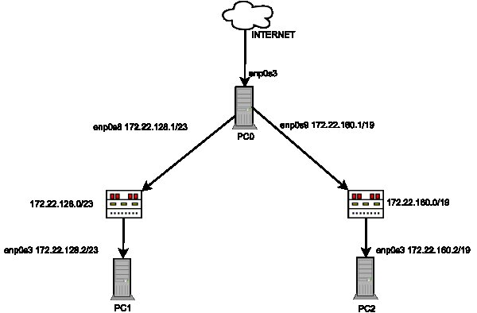

Zadanie 1
---------

1. Zaprojektuj oraz przygotuj prototyp rozwiązania z wykorzystaniem oprogramowania ``VirtualBox`` lub podobnego. 
Zaproponuj rozwiązanie spełniające poniższe wymagania:
   * Usługodawca zapewnia domunikację z siecią internet poprzez interfejs ``eth0`` ``PC0``
   * Zapewnij komunikację z siecią internet na poziomie ``LAN1`` oraz ``LAN2``
   * Dokonaj takiego podziału sieci o adresie ``172.22.128.0/17`` aby w ``LAN1`` można było zaadresować ``500`` adresów natomiast w LAN2 ``5000`` adresów    
   * Przygotuj dokumentację powyższej architektury w formie graficznej w programie ``DIA``
 
Rozwiązanie
-----------

PC0  
-------------------
|  interfejs   | adres  |
|:-------------| :------| 
| eth3 | usługodawca zapewnia komunikację z siecią internet  |
| eth8 | 172.22.128.1/23  |
| eth9 | 172.22.160.1/19  |

użyte komendy:  
``ip addr add _ dev _ `` 
``ip link set _ up``  
``echo 1 > /proc/sys/net/ipv4/ip_forward `` 
``sysctl -w net.ipv4.ip_forward=1 ``(dla pewności właczyłem forwarding dwoma metodami, któraś z nich zadziałała)  
``iptables -t nat -A POSTROUTING -s _ -o _ -j MASQUERADE ``(x2) 

<b>PC1</b>   

|  interfejs   | adres  |
|:-------------| :------| 
|eth3|172.22.128.2/23|

użyte komendy:  
``ip addr add _ dev _ `` 
``ip route add default via _ dev _``

<b>PC2</b> 

|  interfejs   | adres  |
|:-------------| :------| 
| eth3 | 172.22.160.2/19 |

użyte komendy:  
``ip addr add _ dev _ `` 
``ip route add default via _ dev _ ``   

całość została przetestowana komendą ``ping google.pl`` wyegzekwowaną na PC1 i PC2

Podział sieci
-----
``172.22.128.0/17``

<b>LAN1</b> 
W celu otrzymania 500 podsieci należy z części hosta "pożyczyć" 2^n > = 500, n = 9, czyli 17 + 9 = 26.  
``255.255.11111111.11000000 ``  
``255.255.255.192``  
2^6 - 2 = 62 hosty  

<b>Przykłady:</b>  

|Nr podsieci    |     Adres podsieci    |          Zakres hostów                     |           Broadcast         |
|---------------|-----------------------|--------------------------------------------|-----------------------------|
|     1         |   172.22.128.0/26     |   172.22.128.1 - 172.22.128.62             |          172.22.128.63      | 
|     2         |   172.22.128.64/26    |   172.22.128.65 - 172.22.128.126           |          172.22.128.127     |
|     3         |   172.22.128.128/26   |   172.22.128.129 - 172.22.128.190          |          172.22.128.191     |

  

<b>LAN2</b>  

W celu otrzymania 5000 podsieci, należy z części hosta "pożyczyć" 2^n >= 5000, n = 13, czyli 17+13 = 30  
``255.255.11111111.11111100``  
``255.255.255.252``  
2^2 - 2 = 2 hosty  

<b>Przykłady:</b>  

|Nr podsieci    |     Adres podsieci    |          Zakres hostów                     |           Broadcast         |
|---------------|-----------------------|--------------------------------------------|-----------------------------|
|     1         |   172.22.128.0/26     |   172.22.128.1 - 172.22.128.2              |          172.22.128.3       | 
|     2         |   172.22.128.4/26     |   172.22.128.5 - 172.22.128.6              |          172.22.128.7       |
|     3         |   172.22.128.8/26     |   172.22.128.9 - 172.22.128.10             |          172.22.128.11      |

  
Schemat
------------

